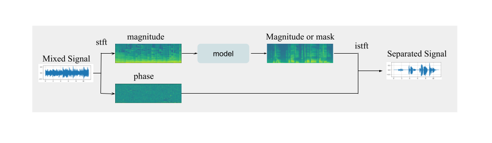
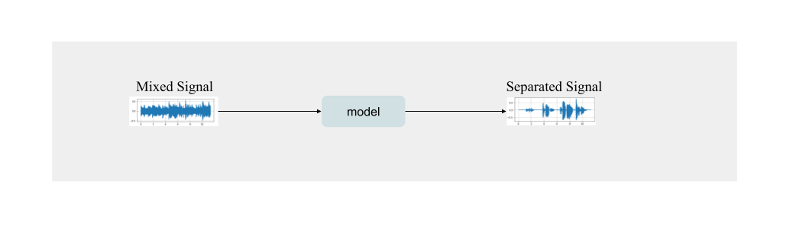

# Singing Voice Separation

A pytorch and torchaudio implemented tool for singing voice separation.

## Introduction

Singing voice separation is one of the music information retrieval tasks and also a
subproblem of speech separation. In the speech separation task, given a mixed speech
signal as input, we want to extract the different target signals from the input and the target
signal can be the voice of each person or the accompaniment of each instrument. As for
singing voice separation, we focus on mainly two targets, the singing voice and the
background accompaniment.

## Method

The methods to solve this task can be divided into two types

* Processing With Short-time Fourier transform



* End-to-End Training



## Implementation

### Requirements

* torch 1.10.1
* torchaudio 0.10.1
* tqdm 4.62.3
* mir-eval 0.6 (for evalutaion only)

### Dataset

[MIR-1K](http://mirlab.org/dataset/public/)

**Download the dataset**
```bash
wget http://mirlab.org/dataset/public/MIR-1K.zip
```
**Split the dataset into training set, validation set, testing set**
```bash
python src/preprocess.py --in-dir ./MIR-1K/Wavfile
```
Default output path:
./dataset/{train, val, test}

### Model

#### Denoising Autoencoder (DAE in model.py)
Based on [Single Channel Audio Source Separation using Convolutional Denoising Autoencoders](https://arxiv.org/abs/1703.08019)

#### Denoising Autoencoder with skip connections (DAESkipConnections in model.py)

### Train
In MIR-1K, channel 0 is the background accompaniment and channel 1 is the singing voice. We can specify the channel to separate in the argument "target-channel"

**Train a model to separate the background accompaniment apart with default arguments**
```
python src/train.py --dataset-path ./dataset --target-channel 0 --model-name DAESkipConnections --model-path model_background.ckpt
```
Model is saved as model_background.ckpt

**Train a model to separate the vocal apart with default arguments**
```
python src/train.py --dataset-path ./dataset --target-channel 1 --model-name DAESkipConnections --model-path model_vocal.ckpt
```
Model is saved as model_vocal.ckpt

**Arguments for training**
```
  --dataset-path DATASET_PATH               path of the dataset (default: None)
  --target-channel TARGET_CHANNEL           index of the channel to be separated (default: None)
  --n-fft N_FFT                             number of fft (argument for stft) (default: 2048)
  --win-length WIN_LENGTH                   window length (argument for stft) (default: 2048)
  --hop-length HOP_LENGTH                   hop length (argument for stft) (default: 512)
  --sample-rate SAMPLE_RATE                 sample rate to resample input wav file (default: 16000)
  --batch-size BATCH_SIZE                   batch size (argument for training) (default: 64)
  --learning-rate LEARNING_RATE             learning rate (argument for training) (default: 0.0003)
  --n-epochs N_EPOCHS                       number of epochs (argument for training) (default: 100)
  --n-frame-in-segment N_FRAME_IN_SEGMENT   number of frames of spectrogram of a 2D segment (argument for training) (default: 15)
  --model-path MODEL_PATH                   path to save trained model (default: model.ckpt)
  --seed SEED                               random seed for training (default: 42)
  --model-name MODEL_NAME                   selected class in model.py (default: DAE)
```

### Test

You can inference all the files in one directory (e.g. ./test ) using a trained model (e.g. ./model_vocal.ckpt) by executing
```bash
python src/test.py --model-path ./model_vocal.ckpt --in-dir ./test
```
Default output path is ./output

**Argument for testing**
```
  --model-path MODEL_PATH                   path of model used for the inference (default: None)
  --in-dir IN_DIR                           path of the input dir (default: None)
  --out-dir OUT_DIR                         path of the output dir (default: output)
  --n-fft N_FFT                             number of fft (argument for stft) (default: 2048)
  --win-length WIN_LENGTH                   window length (argument for stft) (default: 2048)
  --hop-length HOP_LENGTH                   hop length (argument for stft) (default: 512)
  --sample-rate SAMPLE_RATE                 sample rate to resample input wav file (default: 16000)
  --n-frame-in-segment N_FRAME_IN_SEGMENT   number of frames of spectrogram of a 2D segment (default: 15)
  --batch-size BATCH_SIZE                   number of segments in a batch (default: 64)
  --resample RESAMPLE                       to resample input or not (default: True)
```

### Evaluate

Using the same matircs as https://www.music-ir.org/mirex/wiki/2019:Singing_Voice_Separation

**To evaluate the models**

Note that in the evaluation part, you need to specify a list of model paths, corresponding to each channel in the original source like the example below.

```bash
python src/evaluate.py --in-dir dataset/test/ --model-paths model_background.ckpt ./model_vocal.ckpt
```

**Argument for evaluation**
```
  --model-paths MODEL_PATHS                 paths of model used for the inference (default: None)
  --in-dir IN_DIR                           path of the input dir (default: None)
  --n-fft N_FFT                             number of fft (argument for stft) (default: 2048)
  --win-length WIN_LENGTH                   window length (argument for stft) (default: 2048)
  --hop-length HOP_LENGTH                   hop length (argument for stft) (default: 512)
  --sample-rate SAMPLE_RATE                 sample rate to resample input wav file (default: 16000)
  --n-frame-in-segment N_FRAME_IN_SEGMENT   number of frames of spectrogram of a 2D segment (default: 15)
  --batch-size BATCH_SIZE                   number of segments in a batch (default: 64)
  --resample RESAMPLE                       to resample input or not (default: True)
```

## References

* Emad M. Grais, Mark D. Plumbley, “Single Channel Audio Source Separation using
Convolutional Denoising Autoencoders”, arXiv:1703.08019. 2017.
* Chao-Ling Hsu and Jyh-Shing Roger Jang, “On the improvement of singing voice
separation for monaural recordings using the mir-1k dataset”
* A. Jansson, E. J. Humphrey, N. Montecchio, R. M. Bittner, A. Kumar, and T. Weyde,
“Singing voice separation with deep u-net convolutional networks”

